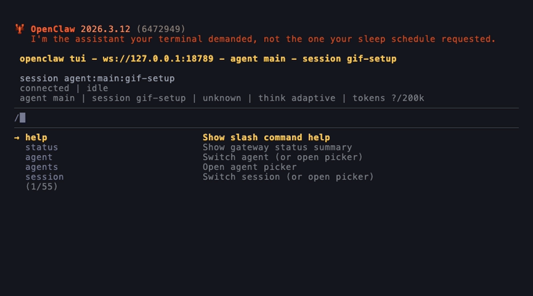
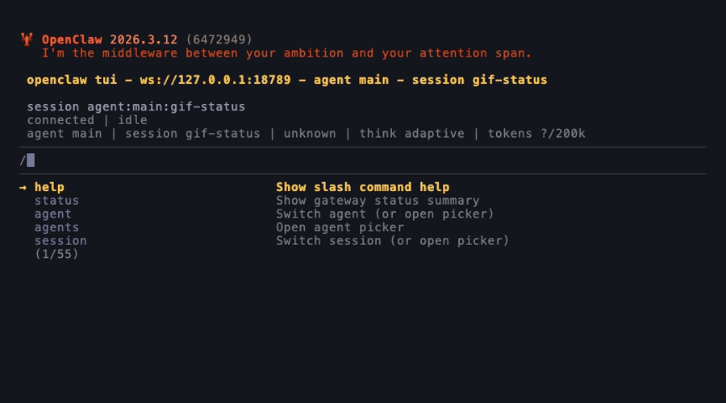

# agent-changelog

A versioning skill for Openclaw that keeps a clear history of workspace changes with sender attribution.

Use it to answer questions like:

- Who changed this file?
- What changed between two points in time?
- Can I roll back to a known good state?

## What you get

- Automatic capture of tracked file changes between turns
- Batched git commits every 10 minutes with per-sender attribution
- Chat/CLI commands for status, log, diff, rollback, and restore
- Optional push to your remote after each batched commit

## Quick start

Requirements: `git`, `jq`, Node.js

1. Add this repo to your workspace `skills/` directory.
2. In your terminal, restart the gateway so the skill is picked up:

```bash
openclaw gateway restart
```

3. In chat, run:

```bash
/agent-changelog setup
```


4. Restart the gateway again to activate the installed hooks:

```bash
openclaw gateway restart
```

5. Verify:

```bash
/agent-changelog status
```


Note: Remote configuration is handled by the setup installer when you opt in to remote push.

## Example usages

Check the latest commit and pending changes:
```text
/agent-changelog show me the recent changes
```

Browse specific recent history:
```text
/agent-changelog show me the last 10 changes made to the SOUL file
```

See what is pending before the next batch commit:
```text
/agent-changelog what are the uncommitted changes?
```

## Configuration

After setup, `.agent-changelog.json` is created (if missing) and defaults to tracking the entire workspace:

```json
{
  "tracked": [
    "."
  ]
}
```

Edit this file to narrow or expand what gets tracked.

## In one minute: how it behaves

- On `message:received`, sender details are captured.
- On `message:sent`, tracked file changes are staged and queued with attribution.
- Every 10 minutes, queued entries are committed together with grouped attribution.

This gives you low-noise, attributable history without manual git bookkeeping every turn.

## Workspace files

| File                        | Purpose                                                                       |
| --------------------------- | ----------------------------------------------------------------------------- |
| `.agent-changelog.json` | Your tracked-files and git push configuration                                 |
| `.version-context`          | Temporary sender handoff between hooks (not committed)                        |
| `pending_commits.jsonl`     | Pending attribution entries waiting for the next batch commit (not committed) |
